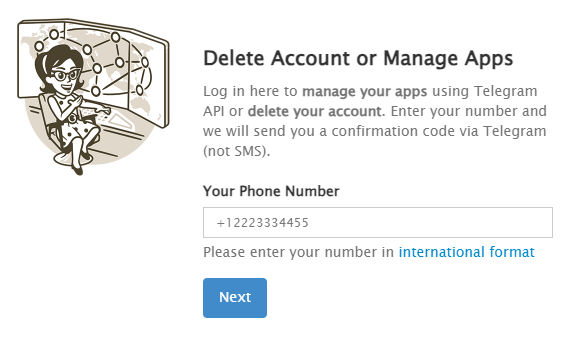
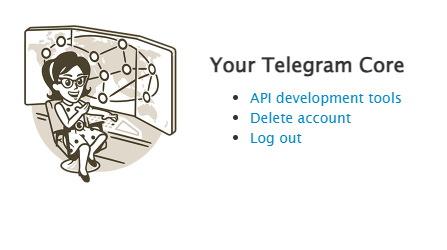
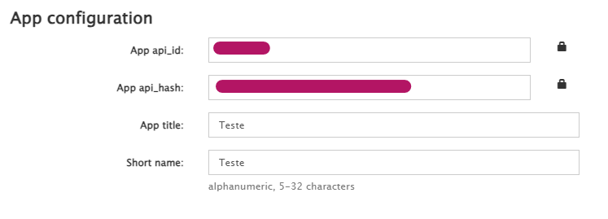
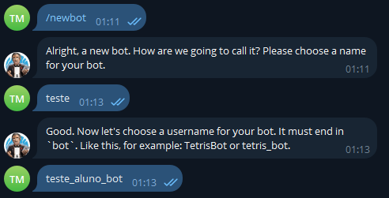
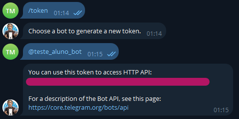

# Aluno Antenado

**Olá devs, tudo certo?**, hoje venho apresentar o projeto que estou trabalhando à algumas semanas, o que eu chamei carinhosamente de ***Aluno Antenado***.

Se você quiser ver o ***Aluno Antenado*** funcionando na prática **[Clique aqui](https://t.me/aluno_antenado_bot)**!

## Oque é? 🤖

O ***Aluno Antenado*** é um BOT de telegram que faz um *web scraping* do **[site de notícias](https://www.gov.br/mec/pt-br/assuntos/noticias/2023/Novembro) oficial do MEC**, e manda a ultima notícia para todos os usuários cadastrados em uma base de dados.

## Como surgiu a idéia? 🤔

Mês passado estava tendo uma aula, e minha professora reclamou que a diretora da minha escola sempre mandava pra ela notícias sobre educação de portais não oficiais como *G1*, *Folha de São Paulo*, etc.

## Execução ⚙️

Começei no meso dia a colocar em prática esse projeto, decidi utilizar o Python com o beutifulsoup4 para fazer o web scrapping. Minha idéia inicial era utilizar o Telethon para entregar a informação via Telegram, contendo o título da matéria, uma breve descrição, o link da materia completa e a data da postagem:

> **MEC debate permanência das mulheres no ambiente acadêmico**
> 
> Em audiência pública, no Senado Federal, debatedoras cobraram mais espaço para as mulheres e medidas para garantir sua permanência nas universidades e institutos de pesquisa
> 
> Fonte: https://www.gov.br/mec/pt-br/assuntos/noticias/2023/outubro/mec-debate-permanencia-das-mulheres-no-ambiente-academico
> 
> Data de publicação: 20/10/2023 10:09

## Set-up 🖱️

### Bot e App

As primeiras e mais importantes coisas são criar o seu **App** e seu **BOT** no Telegram.

### Vamos começar criando o App:

1. Entre no site https://my.telegram.org/;
2. Logue com seu número de telefone;

3. Vá até [API development tools](https://my.telegram.org/apps) e crie sua aplicação;

4. Anote o ***api_id*** e o ***api_hash***.


### Agora vamos criar o BOT:

1. Começe uma conversa com o **[BotFather](https://t.me/BotFather)** no Telegram

2. Digite */newbot* e logo em seguida digite o nome e o username desejado para o bot;


3. Digite */token* e anote o token que o bot vai te mandar;


### Preparando o ambiente

Eu pessoalmente recomendo criar um **venv** para rodar o projeto utilizando o comando:

```cli
~$ python3 -m venv .venv
~$ source .venv/bin/activate
```

Depois de criar o **venv** é preciso instalar as bibliotecas necessárias para o BOT rodar:

```cli
(.venv) ~$ pip install -r requirements.txt
```

### Modificando o código

Tanto na ***main.py*** e na ***manage-users/manage_users.py/*** é necessário fazer alterações nessas áreas:

```python
api_id = 12345678
api_hash = '123456789a0a0a12345a0a0a0a0a123a'
bot_token = "1234567890:ABCDEf_ab0aBC0ABVdefgh0aBcd0a12a_bcd"
```

alterando para suas próprias configurações obtidas nos passos anteriores.

### Se você fez tudo corretamente, PARABÉNS agora você tem seu própio newsletter do MEC com um BOT do telegram.

OBS: O bot funciona por um sistema de DB automatizada, então tanto a ***main.py*** e a ***manage-users/manage_users.py/*** tem que estar rodando 24h, e se quiser aprender a fazer isso em um RaspberryPi [Clique Aqui](https://www.tabnews.com.br/mksDEV08/dica-rodar-um-script-python-em-background-em-um-sistema-ubuntu).
